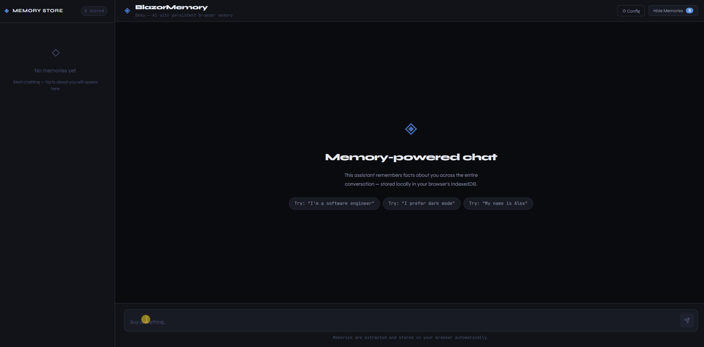

<div align="center">

# 🧠 BlazorMemory

**AI memory layer for .NET — LLM-powered fact extraction, vector search, and persistent memory for Blazor and ASP.NET Core apps.**

[](https://www.nuget.org/packages/BlazorMemory)
[](https://www.nuget.org/packages/BlazorMemory)
[](LICENSE)
[](https://dotnet.microsoft.com)
[](https://github.com/aftabkh4n/BlazorMemory/actions)



</div>

---

## What is BlazorMemory?

BlazorMemory gives your AI assistant a **persistent, searchable memory**. It automatically extracts facts from conversations, stores them as vector embeddings, and injects relevant memories into future prompts — so your assistant actually remembers the user across sessions.

```
User message ──► Extract facts ──► Embed ──► Store
                                               │
Next message ──► Embed query ──► Vector search ──► Inject memories ──► LLM
```

## ✨ Features

- **🔍 Automatic fact extraction** — LLM pulls structured facts from raw conversation
- **🧹 Intelligent consolidation** — deduplicates and updates existing memories instead of storing redundant facts
- **📐 Vector similarity search** — finds semantically relevant memories for any query
- **⏳ Staleness scoring** — surfaces fresh memories over stale ones
- **🌐 Zero backend option** — IndexedDB adapter keeps everything in the user's browser
- **🔌 Provider agnostic** — swap OpenAI for Anthropic or any future provider
- **💉 DI-first** — fluent builder registration, works with any .NET DI container

---

## 📦 Packages

| Package | Description | NuGet |
|---------|-------------|-------|
| `BlazorMemory` | Core library — interfaces, MemoryService, vector math | [](https://www.nuget.org/packages/BlazorMemory) |
| `BlazorMemory.Storage.IndexedDb` | Browser IndexedDB — zero backend, Blazor WASM | [](https://www.nuget.org/packages/BlazorMemory.Storage.IndexedDb) |
| `BlazorMemory.Storage.InMemory` | In-memory — testing and prototyping | [](https://www.nuget.org/packages/BlazorMemory.Storage.InMemory) |
| `BlazorMemory.Storage.EfCore` | EF Core — SQL Server, PostgreSQL, SQLite | [](https://www.nuget.org/packages/BlazorMemory.Storage.EfCore) |
| `BlazorMemory.Embeddings.OpenAi` | OpenAI text-embedding-3-small embeddings | [](https://www.nuget.org/packages/BlazorMemory.Embeddings.OpenAi) |
| `BlazorMemory.Extractor.OpenAi` | OpenAI gpt-4o-mini fact extraction | [](https://www.nuget.org/packages/BlazorMemory.Extractor.OpenAi) |
| `BlazorMemory.Extractor.Anthropic` | Anthropic Claude fact extraction | [](https://www.nuget.org/packages/BlazorMemory.Extractor.Anthropic) |

---

## 🚀 Quickstart

### Blazor WebAssembly (browser, no backend)

```bash
dotnet add package BlazorMemory
dotnet add package BlazorMemory.Storage.IndexedDb
dotnet add package BlazorMemory.Embeddings.OpenAi
dotnet add package BlazorMemory.Extractor.OpenAi
```

**`Program.cs`**
```csharp
builder.Services
    .AddBlazorMemory()
    .UseIndexedDbStorage()
    .UseOpenAiEmbeddings(apiKey)
    .UseOpenAiExtractor(apiKey);
```

### Server-side / EF Core

```bash
dotnet add package BlazorMemory
dotnet add package BlazorMemory.Storage.EfCore
dotnet add package BlazorMemory.Embeddings.OpenAi
dotnet add package BlazorMemory.Extractor.OpenAi
```

**`Program.cs`**
```csharp
builder.Services
    .AddBlazorMemory()
    .UseEfCoreStorage<YourDbContext>()
    .UseOpenAiEmbeddings(apiKey)
    .UseOpenAiExtractor(apiKey);
```

### Use with Anthropic Claude

```bash
dotnet add package BlazorMemory.Extractor.Anthropic
```

```csharp
builder.Services
    .AddBlazorMemory()
    .UseIndexedDbStorage()
    .UseOpenAiEmbeddings(openAiKey)
    .UseAnthropicExtractor(anthropicKey);
```

---

## 💡 Usage

```csharp
public class ChatService(IMemoryService memory)
{
    private const string UserId = "user_123";

    public async Task<string> ChatAsync(string userMessage)
    {
        // 1. Retrieve relevant memories
        var memories = await memory.QueryAsync(userMessage, UserId,
            new QueryOptions { Limit = 5, Threshold = 0.65f });

        // 2. Build system prompt with memories injected
        var context    = string.Join("\n", memories.Select(m => $"- {m.Content}"));
        var systemPrompt = $"""
            You are a helpful assistant with persistent memory.
            What you remember about this user:
            {context}
            """;

        // 3. Call your LLM
        var reply = await CallLlmAsync(systemPrompt, userMessage);

        // 4. Extract and store new facts in the background
        await memory.ExtractAsync($"User: {userMessage}\nAssistant: {reply}", UserId);

        return reply;
    }
}
```

---

## 🏗️ Architecture

```
BlazorMemory (Core)
├── IMemoryService          — query, extract, update, delete
├── IMemoryStore            — storage abstraction (IndexedDB / EfCore / InMemory)
├── IEmbeddingsProvider     — vector embedding abstraction
├── IMemoryExtractor        — fact extraction + consolidation abstraction
├── ExtractionEngine        — orchestrates extract → embed → consolidate → store
├── StalenessCalculator     — time-based memory relevance scoring
└── VectorMath              — cosine similarity

Storage Adapters
├── BlazorMemory.Storage.IndexedDb    — browser-native, zero backend
├── BlazorMemory.Storage.InMemory     — for testing
└── BlazorMemory.Storage.EfCore       — SQL Server / PostgreSQL / SQLite

AI Providers
├── BlazorMemory.Embeddings.OpenAi    — text-embedding-3-small
├── BlazorMemory.Extractor.OpenAi     — gpt-4o-mini
└── BlazorMemory.Extractor.Anthropic  — claude-haiku
```

---

## 🧪 Running the Sample App

```bash
git clone https://github.com/aftabkh4n/BlazorMemory
cd BlazorMemory/samples/ChatApp.BlazorWasm
dotnet run
```

Open `http://localhost:5000`, enter your OpenAI API key, and start chatting. Memories appear in the left panel as facts are extracted.

---

## 🧪 Running Tests

```bash
dotnet test
```

34 tests across 4 test projects — all passing.

---

## 📋 Roadmap

- [ ] Memory namespaces (per-topic isolation)
- [ ] Export / import memories (JSON backup)
- [ ] Relevance feedback ("forget this" / "this is important")
- [ ] pgvector support for PostgreSQL
- [ ] Multi-user support improvements
- [ ] Blazor component library (drop-in memory panel)

---

## 🤝 Contributing

Contributions are welcome! Please open an issue first to discuss what you'd like to change.

---

## 📄 License

MIT — see [LICENSE](LICENSE) for details.

---

<div align="center">
Built with ❤️ using .NET 8, Blazor, and a sprinkle of AI
</div>